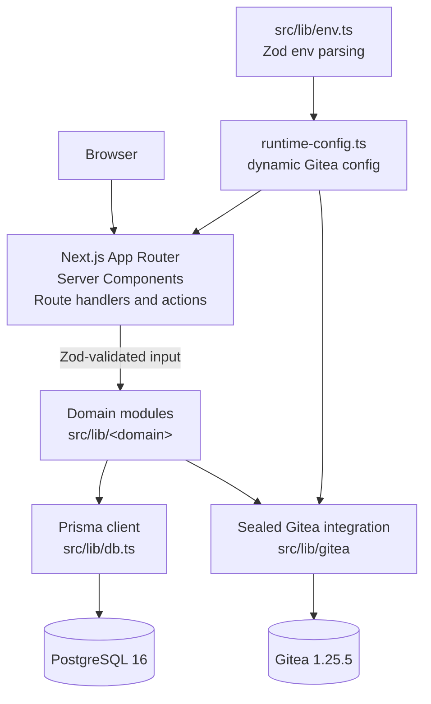
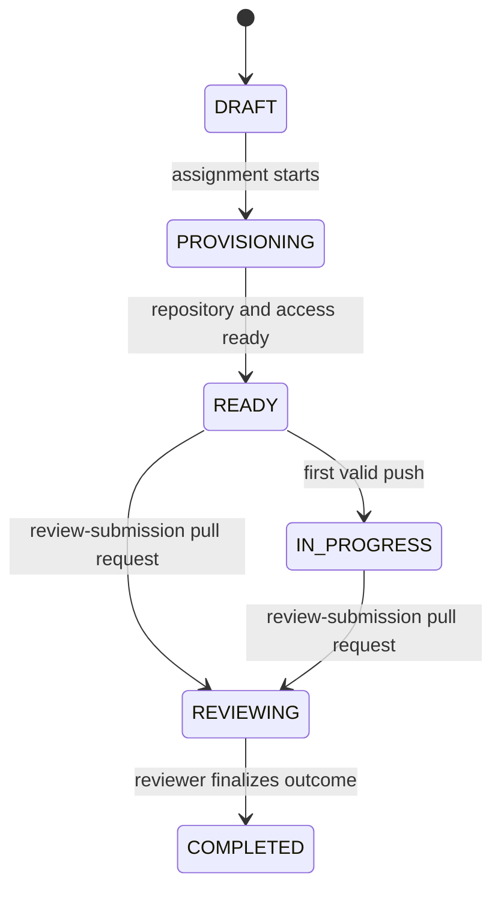
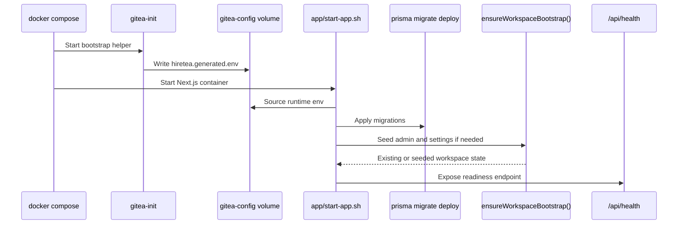

# Contributing to Hiretea

Thank you for your interest in contributing to Hiretea. This document covers the technical architecture, development setup, and conventions you need to know.

## Architecture overview



### Boundaries

- **Auth boundary**: `next-auth` v4 with the `@next-auth/prisma-adapter` and a custom Gitea OAuth provider (`src/lib/auth/providers/gitea.ts`). Sessions are typed and exposed through `requireAuthSession` / `requireRole` helpers (`src/lib/auth/session.ts`).
- **Data boundary**: A single `PrismaClient` lives in `src/lib/db.ts`. Domain modules consume it directly; route layers never instantiate Prisma.
- **Integration boundary**: All Gitea HTTP/REST concerns are sealed inside `src/lib/gitea/*`. Other domains call typed helpers (`createCaseRepository`, `grantRepositoryAccess`, `ensureRepositoryWebhook`, etc.) and never see raw Gitea types.
- **Config boundary**: `src/lib/env.ts` parses `process.env` once with Zod (all env vars are optional because the runtime file may seed them). Gitea-specific runtime resolution (`runtime-config.ts`) is re-evaluated per request to absorb Docker-bootstrapped values.

## Tech stack

| Layer        | Choice                                                     |
| ------------ | ---------------------------------------------------------- |
| Runtime      | Bun (dev/scripts), Node.js (Next.js prod server)           |
| Framework    | Next.js 16 (App Router, React 19, React Compiler)          |
| UI           | Radix Themes 3, Radix Icons, dark mode only                |
| Auth         | NextAuth 4 + Prisma Adapter, custom Gitea OAuth provider   |
| ORM          | Prisma 7 with `@prisma/adapter-pg` over `pg` 8             |
| Database     | PostgreSQL 16 (separate Hiretea + Gitea schemas)           |
| Code host    | Gitea 1.25.5 rootless (bundled in Compose)                 |
| Validation   | Zod 4 (per-domain `schemas.ts`)                            |
| Client state | Zustand 5 (UI-only, never source of truth)                 |
| Lint/format  | Biome 2                                                    |
| Tests        | Vitest 4 (unit + Postgres-backed integration), shell smoke |
| Container    | Multi-stage Dockerfile, Docker Compose `develop.watch`     |

## Repository layout

```text
src/app/                           # Next.js App Router
  (public)/                        # Landing page, /setup, /invite, /team-invite
    components/                    # (reserved, currently empty)
    invite/[token]/                # Candidate invite claim
    setup/                         # Manual bootstrap fallback
    team-invite/[token]/            # Recruiter invite claim
  (auth)/sign-in/                  # NextAuth sign-in surface
  (app)/dashboard/                 # Authenticated workspace
    components/dashboard-overview.tsx
    candidate-cases/               # List, detail, archive, restore, access
      new/                         # New case assignment
      [candidateCaseId]/           # Case detail page
        components/                # Page-local sections
      components/                 # Feature-shared components (table, forms, actions)
    candidates/                    # Provisioning + invite controls
      new/                         # New candidate form
      components/                  # Table, actions, credential cell
    case-templates/                # Templates, reviewer guides, rubrics
      new/                         # New template form
      components/                  # Table, forms, helpers
    reviews/                       # Review workflow per case
      [candidateCaseId]/           # Per-case review page
      components/                  # Review table, note form
    team/                          # Recruiter team + invites
      new/                         # New recruiter form
      components/                  # Table, actions, credential cell
    settings/                      # Workspace settings form
      components/
    audit-trail/                   # Audit log viewer (read-only, no actions.ts)
      components/
  api/
    auth/[...nextauth]/            # NextAuth handler
    health/                        # Liveness + readiness JSON
    webhooks/gitea/                # Signed Gitea webhook receiver

src/components/
  providers/
    app-providers.tsx              # Radix Theme + SessionProvider + ToastProvider
    toast-provider.tsx              # Custom toast system (success/error/info)
  ui/
    app-logo.tsx                    # HT glyph + Hiretea branding
    confirmation-dialog.tsx         # Radix AlertDialog for destructive confirmations
    empty-state.tsx                 # Empty state placeholder for sections
    section-card.tsx                # Section container with title/eyebrow
    status-badge.tsx                # Colored status indicator

src/lib/
  auth/                            # NextAuth config, session helpers, authorization
    config.ts                      # getAuthOptions()
    session.ts                     # requireAuthSession(), requireRole()
    authorization.ts               # assertActorHasRole(), assertInternalOperator()
    providers/gitea.ts             # createGiteaProvider()
  audit/
    log.ts                         # createAuditLog()
    queries.ts                     # listRecentAuditLogs()
  bootstrap/
    complete-bootstrap.ts          # ensureWorkspaceBootstrap(), completeBootstrapSetup()
    schemas.ts                     # bootstrapSetupSchema
    status.ts                      # getBootstrapStatus(), buildBootstrapStatus()
  candidate-cases/
    create-candidate-case.ts
    update-candidate-case.ts
    delete-candidate-case.ts
    restore-candidate-case.ts
    revoke-case-access.ts
    candidate-completion.ts        # Completion tracking, deadline, Gitea login observation
    queries.ts                     # List, detail, assignment options
    schemas.ts                     # Create/update input validation
  candidate-invites/
    issue-candidate-invite.ts
    claim-candidate-invite.ts
    revoke-candidate-invite.ts
    queries.ts
    shared.ts                      # Token hashing, lifecycle status helpers
  candidates/
    provision-candidate.ts
    delete-candidate.ts
    queries.ts
    schemas.ts
  case-templates/
    create-case-template.ts
    update-case-template.ts
    queries.ts                     # List, reviewer options, source repos
    schemas.ts
  dashboard/
    queries.ts                     # getDashboardSummary() — role-aware counts
  evaluation-notes/
    create-evaluation-note.ts
    queries.ts
    schemas.ts                     # Score 1-10, summary 12-160 chars, optional decision
  git/
    run-git-command.ts              # Sandboxed git CLI (blocked env vars, credential sanitization)
  gitea/
    client.ts                      # Typed admin REST client + helpers
    runtime-config.ts              # Resolves OAuth/admin/webhook/migration config per request
    accounts.ts                    # createCandidateAccount / createRecruiterAccount / delete
    repositories.ts                # createCaseRepository, generateCaseRepositoryFromTemplate, sync, delete
    permissions.ts                 # grantRepositoryAccess / revokeRepositoryAccess
    teams.ts                       # ensureRecruiterTeamMembership
    webhooks.ts                    # ensureRepositoryWebhook, processGiteaWebhookDelivery
    validation.ts                  # validateGiteaWorkspaceSettings
  permissions/
    roles.ts                       # hasAnyRole(), isInternalRole()
  recruiter-invites/
    issue-recruiter-invite.ts
    claim-recruiter-invite.ts
    revoke-recruiter-invite.ts
    shared.ts                      # Token hashing, lifecycle status helpers
  recruiters/
    provision-recruiter.ts
    delete-recruiter.ts
    queries.ts
    schemas.ts
  workspace-settings/
    update-workspace-settings.ts
    queries.ts                     # getWorkspaceSettings(), getWorkspaceSettingsOrThrow()
    schemas.ts
  db.ts                            # Single PrismaClient instance
  env.ts                           # Zod-parsed env contract (all optional)

prisma/
  schema.prisma                    # Single source of truth for the data model
  migrations/                      # Tracked SQL migrations

docker/
  scripts/bootstrap-app.ts         # Bun-based per-app bootstrap entrypoint
  scripts/start-app.sh             # Container start script (dev / prod)
  scripts/wait-for-stack.ts        # Compose readiness waiter
  postgres/init/                   # Per-database init SQL
  gitea-init/                      # Image that seeds Gitea admin/org/OAuth/webhook

tests/
  unit/                            # Pure-module Vitest suites
  integration/                     # Postgres-backed Vitest suites
  setup/integration.ts             # Integration bootstrap harness
  smoke-test.sh                    # Full-stack Docker reachability check
  integration-test.sh              # Spins integration deps and runs Vitest
```

## Domain model

Defined in `prisma/schema.prisma`. Notable models and their key fields:

- **`User`** — authoritative person record with `role` (`ADMIN | RECRUITER | CANDIDATE`, default `CANDIDATE`), `isActive` (default `true`), linked 1:1 to **`GiteaIdentity`**.
- **`GiteaIdentity`** — stores `giteaUserId`, `login`, `profileUrl`, `avatarUrl`, the `initialPassword` generated at provisioning, and `firstObservedLoginAt` / `lastObservedLoginAt` timestamps for candidate completion tracking.
- **`WorkspaceSettings`** — single-row workspace configuration: `companyName`, `defaultBranch`, `manualInviteMode`, `giteaBaseUrl`, `giteaAdminBaseUrl`, `giteaOrganization`, `giteaAuthClientId`.
- **`CaseTemplate`** — reusable challenge definition with a unique `slug` and a unique `(repositoryOwner, repositoryName)`. `repositorySourceKind` is one of `PROVISIONED`, `LINKED_EXISTING`, or `COPIED_FROM_EXISTING`. Owns **`CaseTemplateReviewerAssignment`** (default reviewers), **`CaseTemplateReviewGuide`** (instructions, decision guidance), and **`CaseTemplateRubricCriterion`** (with weights and sort order).
- **`CandidateCase`** — per-candidate assignment derived from a template. Carries `status` (`DRAFT → PROVISIONING → READY → IN_PROGRESS → REVIEWING → COMPLETED → ARCHIVED`), optional `decision` (`ADVANCE | HOLD | REJECT`), `workingRepository`, `branchName`, `workingRepositoryUrl`, `dueAt`, `startedAt`, `submittedAt`, `reviewedAt`, `lastSyncedAt`, `candidateCompletionRequestedAt`, `candidateCompletionLockedAt`, and `candidateCompletionSource` (`MANUAL | AUTO_DEADLINE`). Owns **`CandidateAccessGrant`** (per-permission row), **`CandidateCaseReviewerAssignment`**, and **`EvaluationNote`**.
- **`CandidateInvite` / `RecruiterInvite`** — tokenized invite chains. `tokenHash` is unique; `expiresAt`, `claimedAt`, `revokedAt` track lifecycle; `issueKind` (`INITIAL | RESEND`); `resendSequence` is unique per recipient. The raw token is never persisted.
- **`AuditLog`** — append-only `(actorId?, action, resourceType, resourceId?, detail Json?, ipAddress?, userAgent?, createdAt)`.
- **`WebhookDelivery`** — append-only Gitea webhook record with `deliveryId` (unique), `eventName`, `payload Json`, optional `statusCode`, `errorMessage`, and `processedAt`.
- **`Account` / `Session` / `VerificationToken`** — NextAuth Prisma Adapter tables.

## Candidate case lifecycle



### Candidate completion tracking

Cases can be marked complete through two paths:

- **Manual** — A recruiter or admin marks the case complete from the dashboard.
- **Auto-deadline** — A scheduled process observes `dueAt` and advances cases past deadline whose candidates have already logged into Gitea (tracked via `firstObservedLoginAt` on the `GiteaIdentity`).

The `candidateCompletionRequestedAt`, `candidateCompletionLockedAt`, and `candidateCompletionSource` fields on `CandidateCase` record when and how completion was triggered.

## Development

### Prerequisites

- Docker and Docker Compose
- [Bun](https://bun.sh/)
- Node.js (for Next.js production server)

### Environment setup

```bash
cp .env.example .env
# Edit .env as needed for your local setup
```

### Running the stack

```bash
# Production-style build + start + wait for health
bun run docker:up

# Development with hot reload and Compose watch
bun run docker:watch
```

### Useful commands

```bash
# Quality gates
bun run lint              # biome lint --write --unsafe
bun run lint:ci           # biome lint .
bun run typecheck         # tsc --noEmit
bun run check             # biome check + typecheck
bun run format            # biome format --write .

# Tests
bun run test:unit         # vitest run (pure modules)
bun run test:integration  # spins integration deps + vitest
bun run test:smoke        # full-stack Docker reachability check
bun run test:ci           # lint:ci + typecheck + unit + integration

# Prisma
bun run db:generate       # prisma generate
bun run db:migrate        # prisma migrate dev
bun run db:push           # prisma db push (no migration file)
bun run db:studio         # prisma studio

# Build / serve outside Docker
bun run build             # next build
bun run start             # next start
bun run dev               # next dev
```

## Testing

Hiretea separates test layers by purpose:

- **Unit** (`tests/unit`, `bun run test:unit`) — pure-module Vitest suites. No I/O.
- **Integration** (`tests/integration`, `bun run test:integration`) — Postgres-backed Vitest suites exercising full domain workflows.
- **Smoke** (`tests/smoke-test.sh`, `bun run test:smoke`) — full-stack Docker verification.
- **CI gate** (`bun run test:ci`) — `lint:ci` + `typecheck` + `test:unit` + `test:integration`.

## Continuous integration

The repository uses GitHub Actions (`.github/workflows/test.yml`) with three jobs:

| Job           | Trigger                                    | What it runs                                        |
| ------------- | ------------------------------------------ | --------------------------------------------------- |
| `quality`     | Push to `master`, pull requests            | `lint:ci` + `typecheck` + `test:unit`               |
| `integration` | Push to `master`, pull requests            | `test:integration` (spins Postgres via Docker)      |
| `smoke`       | `workflow_dispatch` or scheduled runs only | `test:smoke` (full-stack Docker reachability check) |

## Execution semantics

- **Render model** — Server Components by default; client boundaries only where interaction or browser APIs are required. Read models in `queries.ts`, route files orchestrate only.
- **Auth model** — `getAuthOptions()` resolves the Gitea OAuth provider dynamically from runtime config. Sessions use the NextAuth database strategy (not JWTs). Typed session shape augmented in `src/types/next-auth.d.ts` with `id`, `role`, `isActive`.
- **Bootstrap model** — `ensureWorkspaceBootstrap()` is idempotent. If an admin and settings row already exist, it returns existing state. Manual `/setup` requires `BOOTSTRAP_TOKEN` and refuses to run once an admin exists.
- **Consistency model** — Pure database workflows use Prisma transactions. Cross-system workflows (PostgreSQL + Gitea) use compensating rollback: create external resource, persist internal state, explicitly delete/revoke on downstream failure.
- **Audit model** — Operationally meaningful mutations write append-only audit rows even when a step is skipped or a fallback is taken.
- **Git security** — `src/lib/git/run-git-command.ts` runs git commands in a sandboxed environment: blocked dangerous env vars, blocked dangerous argument prefixes, output sanitization that redacts auth credentials, maximum 600s timeout, 1MB output buffer.

## Runtime bootstrap sequence



## Dockerfile build targets

The Dockerfile defines four stages:

1. **`base`** — Installs git, runs `bun install --frozen-lockfile` with retry (up to 3 attempts).
2. **`development`** — Extends `base`, copies source, generates Prisma client, runs `bun run dev`.
3. **`builder`** — Extends `base`, copies source, generates Prisma client, runs `bun run build`.
4. **`production`** — Fresh `oven/bun:alpine` image, copies built artifacts from `builder`, installs git, runs `bun run start`.

Docker Compose selects the target via `HIRETEA_APP_BUILD_TARGET` (defaults to `production`).

## Environment contract

`.env` keys consumed by the stack (see `.env.example` for defaults):

| Group                       | Keys                                                                                                                                                                                               |
| --------------------------- | -------------------------------------------------------------------------------------------------------------------------------------------------------------------------------------------------- |
| App                         | `APP_HTTP_PORT`, `NEXTAUTH_URL`, `NEXTAUTH_SECRET`, `BOOTSTRAP_TOKEN`, `hiretea_ADMIN_EMAIL`, `hiretea_ADMIN_NAME`, `hiretea_COMPANY_NAME`, `hiretea_DEFAULT_BRANCH`, `hiretea_MANUAL_INVITE_MODE` |
| Database                    | `DB_PORT`, `HT_DB_NAME`, `HT_DB_USER`, `HT_DB_PASSWORD`, `GITEA_DB_NAME`, `GITEA_DB_USER`, `GITEA_DB_PASSWORD`                                                                                     |
| Gitea network               | `GITEA_HTTP_PORT`, `GITEA_SSH_PORT`, `GITEA_PUBLIC_URL`, `GITEA_DOMAIN`                                                                                                                            |
| Gitea admin                 | `GITEA_ADMIN_USERNAME`, `GITEA_ADMIN_EMAIL`, `GITEA_ADMIN_PASSWORD`, `GITEA_ADMIN_BASE_URL`, `GITEA_ORGANIZATION_NAME`                                                                             |
| Gitea security              | `GITEA_SECRET_KEY`, `GITEA_INTERNAL_TOKEN`, `GITEA_WEBHOOK_SECRET`                                                                                                                                 |
| OAuth (resolved at runtime) | `AUTH_GITEA_ID`, `AUTH_GITEA_SECRET`, `AUTH_GITEA_ISSUER`                                                                                                                                          |
| Build modes                 | `HIRETEA_APP_BUILD_TARGET` (`production` \| `development`), `HIRETEA_APP_MODE` (`prod` \| `dev`)                                                                                                   |

All env vars are optional in `src/lib/env.ts` because the runtime env file (`/runtime/gitea/hiretea.generated.env`) may seed them. Pinning `NEXTAUTH_SECRET`, `GITEA_SECRET_KEY`, `GITEA_INTERNAL_TOKEN`, `GITEA_WEBHOOK_SECRET`, `BOOTSTRAP_TOKEN`, and `GITEA_ADMIN_PASSWORD` is recommended for repeatable production environments.

## HTTP surface

| Route                                  | Method   | Auth                              | Notes                                                                          |
| -------------------------------------- | -------- | --------------------------------- | ------------------------------------------------------------------------------ |
| `/`                                    | GET      | Public                            | Landing page                                                                   |
| `/sign-in`                             | GET      | Public                            | NextAuth sign-in (Gitea)                                                       |
| `/setup`                               | GET/POST | Public, gated by bootstrap status | First-run admin + workspace settings seed                                      |
| `/invite/[token]`                      | GET/POST | Public                            | Candidate invite claim                                                         |
| `/team-invite/[token]`                 | GET/POST | Public                            | Recruiter invite claim                                                         |
| `/dashboard`                           | GET      | Auth (internal roles)             | Live overview                                                                  |
| `/dashboard/candidate-cases`           | GET      | Auth (`ADMIN`/`RECRUITER`)        | List + actions                                                                 |
| `/dashboard/candidate-cases/[id]`      | GET      | Auth                              | Detail (workspace, repo activity, reviews, audit, template guide, quick links) |
| `/dashboard/candidates`                | GET      | Auth                              | Provisioning + invite controls                                                 |
| `/dashboard/case-templates`            | GET      | Auth                              | Template list, reviewer guides, rubrics                                        |
| `/dashboard/reviews`                   | GET      | Auth                              | Review queue                                                                   |
| `/dashboard/reviews/[candidateCaseId]` | GET      | Auth                              | Per-case review workflow                                                       |
| `/dashboard/team`                      | GET      | Auth (`ADMIN`)                    | Recruiter team + invites                                                       |
| `/dashboard/settings`                  | GET      | Auth (`ADMIN`)                    | Workspace settings                                                             |
| `/dashboard/audit-trail`               | GET      | Auth                              | Recent audit log                                                               |
| `/api/auth/[...nextauth]`              | GET/POST | NextAuth                          | OAuth callback + session                                                       |
| `/api/health`                          | GET      | Public                            | `{ ok, databaseReady, runtimeReadiness }`                                      |
| `/api/webhooks/gitea`                  | POST     | HMAC-SHA256 signed                | Gitea event sink                                                               |

## Operational invariants

- **No JIT internal provisioning from OAuth** — Gitea OAuth authenticates identity, but dashboard access is allowlisted through existing `User` rows.
- **Candidate dashboard access is denied twice** — during NextAuth sign-in and at server route guards.
- **`WorkspaceSettings` behaves like a singleton** — bootstrap creates or updates the first row.
- **Bootstrap forces manual invite mode on** — `manualInviteMode` is seeded as `true`.
- **Invite tokens are stored hashed at rest** — only the delivered URL contains the raw token.
- **Temporary candidate credentials are ephemeral** — cleared after successful internal sign-in.
- **Webhook storage is append-oriented and idempotent by delivery id**.
- **Cross-system workflows prefer cleanup over partial success** — repository access and repositories are explicitly revoked/deleted when the matching database write cannot be completed.

## Architectural rules

These are enforced as code review and structural conventions:

- The entire product is English-only, including code identifiers, documentation, and UI copy.
- Page layers stay thin and delegate business logic to dedicated domain services under `src/lib/<domain>`.
- Server actions live in the nearest route segment `actions.ts` with `"use server"`; they handle auth + Zod parsing + domain call + `revalidatePath` only.
- Inputs are validated with Zod schemas in per-domain `schemas.ts` files. Inferred types are reused in actions and forms.
- Read models come from `queries.ts` files and return UI-ready shapes, not raw Prisma rows.
- Shared UI primitives live under `src/components/ui`; page-local components stay next to the page that uses them.
- All mutations that matter operationally call `createAuditLog()`.
- Gitea integration details must stay inside `src/lib/gitea`. No other module imports raw Gitea types.
- Prisma access is centralized through `src/lib/db.ts`. No ad-hoc `new PrismaClient()`.
- Environment access goes through `src/lib/env.ts` (and `src/lib/gitea/runtime-config.ts` for Gitea runtime values). No direct `process.env` reads in feature code.
- Zustand is reserved for client-side UI state only. Server data remains the source of truth on the server.
- Default to Server Components. Add `"use client"` only when interaction, browser APIs, or client state is genuinely required.
- Use Radix `AlertDialog` (via `ConfirmationDialog`) for destructive confirmations. Use the shared toast provider for success/error feedback. Do not use `alert()`.

## Troubleshooting

- **OAuth unavailable after bootstrap.** Verify `NEXTAUTH_SECRET` is present and the Gitea OAuth redirect URI exactly matches `${NEXTAUTH_URL}/api/auth/callback/gitea`. Check `/api/health` — `runtimeReadiness.authReady` must be `true`.
- **Candidate case assignment fails during repository migration.** Confirm Gitea is running with `GITEA__migrations__ALLOW_LOCALNETWORKS=true` and `GITEA__server__LOCAL_ROOT_URL=http://gitea:3000/`. The migration helper relies on the internal URL.
- **Webhook delivery unavailable.** Ensure Gitea can reach `POST ${NEXTAUTH_URL}/api/webhooks/gitea` from the Docker network and that `runtimeReadiness.webhookReady` is `true`. Check `WebhookDelivery` rows for `errorMessage` to triage signature or event mismatches.
- **Invite link rejected.** Only the most recent active invite per `(recipient, resendSequence)` is claimable. Inspect the `CandidateInvite` / `RecruiterInvite` row for `expiresAt`, `revokedAt`, and `claimedAt`.
- **Reset everything.** `docker compose -p hiretea down --volumes --remove-orphans --rmi all || true` clears all state.
