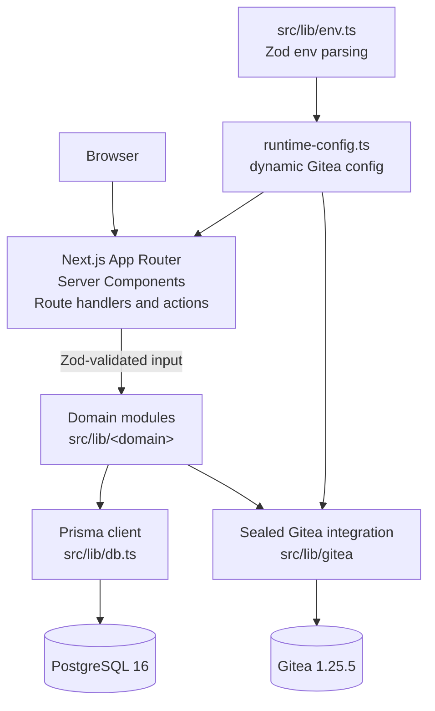
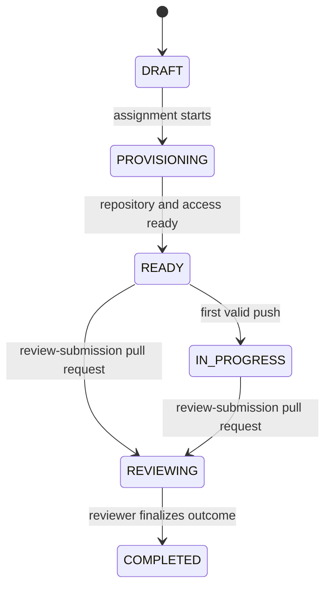
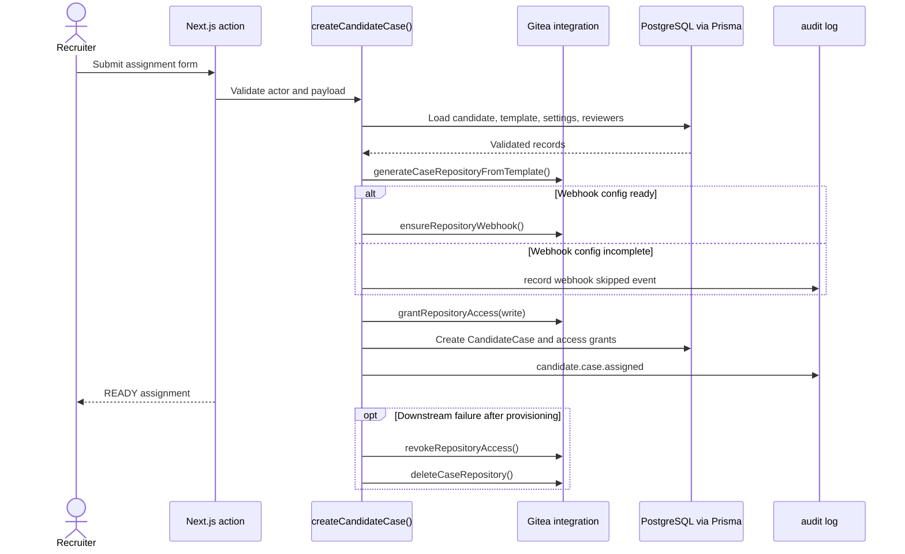
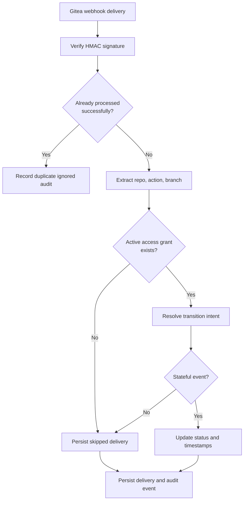
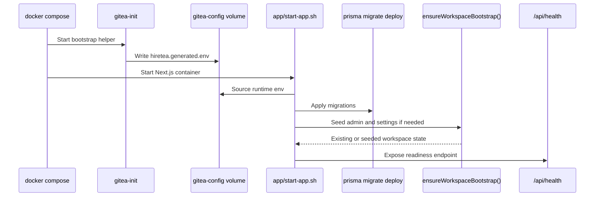

# Hiretea

Hiretea is a self-hosted technical hiring workspace built on Next.js, Prisma, PostgreSQL, and a bundled Gitea instance. It is a control plane for technical assessments: define case templates against your own Gitea repositories, provision candidate accounts, assign per-candidate working repositories, capture reviewer signal, and keep an auditable trail of every state transition in between.

The entire product is English-only, dark-mode first, and self-hosted by default. Gitea is the source of truth for code identity and repository activity; Postgres (via Prisma) is the source of truth for hiring workflow state.

## Table of Contents

- [Architecture Overview](#architecture-overview)
- [Tech Stack](#tech-stack)
- [Repository Layout](#repository-layout)
- [Domain Model](#domain-model)
- [Execution Semantics](#execution-semantics)
- [Critical Workflow Sequences](#critical-workflow-sequences)
- [Operational Invariants](#operational-invariants)
- [Feature Reference](#feature-reference)
- [Runtime & Bootstrap](#runtime--bootstrap)
- [Setup](#setup)
- [Default Ports](#default-ports)
- [Environment Contract](#environment-contract)
- [Runtime Credentials](#runtime-credentials)
- [HTTP Surface](#http-surface)
- [Useful Commands](#useful-commands)
- [Testing Workflow](#testing-workflow)
- [Manual Setup Page](#manual-setup-page)
- [Troubleshooting](#troubleshooting)
- [Architectural Rules](#architectural-rules)

## Architecture Overview



- **Auth boundary**: `next-auth` v4 with the `@next-auth/prisma-adapter` and a custom Gitea OAuth provider (`src/lib/auth/providers/gitea.ts`). Sessions are typed and exposed through `requireAuthSession` / `requireRole` helpers (`src/lib/auth/session.ts`).
- **Data boundary**: A single `PrismaClient` lives in `src/lib/db.ts`. Domain modules consume it directly; route layers never instantiate Prisma.
- **Integration boundary**: All Gitea HTTP/REST concerns are sealed inside `src/lib/gitea/*`. Other domains call typed helpers (`createCaseRepository`, `grantRepositoryAccess`, `ensureRepositoryWebhook`, etc.) and never see raw Gitea types.
- **Config boundary**: `src/lib/env.ts` parses `process.env` once with Zod. Gitea-specific runtime resolution (token, OAuth client, webhook secret, public/internal URLs) lives in `src/lib/gitea/runtime-config.ts` and is re-evaluated per request to absorb Docker-bootstrapped values.

## Tech Stack

| Layer        | Choice                                                     |
| ------------ | ---------------------------------------------------------- |
| Runtime      | Bun (dev/scripts), Node.js (Next.js prod server)           |
| Framework    | Next.js 16 (App Router, React 19, React Compiler)          |
| UI           | Radix Themes 3, Radix Icons, dark mode only                |
| Auth         | NextAuth 4 + Prisma Adapter, custom Gitea OAuth provider   |
| ORM          | Prisma 7 with `@prisma/adapter-pg` over `pg` 8             |
| Database     | PostgreSQL 16 (separate Hiretea + Gitea schemas)           |
| Code host    | Gitea 1.25.5 rootless (bundled in Compose)                 |
| Validation   | Zod 4 (per-domain `schemas.ts`)                            |
| Client state | Zustand 5 (UI-only, never source of truth)                 |
| Lint/format  | Biome 2                                                    |
| Tests        | Vitest 4 (unit + Postgres-backed integration), shell smoke |
| Container    | Multi-stage Dockerfile, Docker Compose `develop.watch`     |

## Repository Layout

```text
src/app/                           # Next.js App Router
  (public)/                        # Marketing, /setup, /invite, /team-invite
  (auth)/sign-in/                  # NextAuth sign-in surface
  (app)/dashboard/                 # Authenticated workspace
    candidate-cases/               # List, detail, archive, restore, access
    candidates/                    # Provisioning + invite controls
    case-templates/                # Templates, reviewer guides, rubrics
    reviews/                       # Review workflow per case
    team/                          # Recruiter team + invites
    settings/                      # Workspace settings
    audit-trail/                   # Audit log viewer
  api/
    auth/[...nextauth]/            # NextAuth handler
    health/                        # Liveness + readiness JSON
    webhooks/gitea/                # Signed Gitea webhook receiver

src/components/
  providers/                       # AppProviders, ToastProvider
  ui/                              # SectionCard, StatusBadge, AppLogo

src/lib/
  auth/                            # NextAuth config, session helpers, authorization
  audit/                           # createAuditLog + queries
  bootstrap/                       # First-run status + completion
  candidate-cases/                 # Lifecycle, queries, restore, access revoke
  candidate-invites/               # Issue / claim / revoke / shared token utils
  candidates/                      # Provisioning + deletion
  case-templates/                  # Template CRUD, reviewer guides, sourcing
  dashboard/                       # Aggregated counts for the overview
  evaluation-notes/                # Reviewer notes + review case queries
  git/                             # Low-level git CLI runner
  gitea/                           # Sealed Gitea integration (see below)
  permissions/                     # Role helpers
  recruiter-invites/               # Mirrors candidate-invites for recruiters
  recruiters/                      # Recruiter provisioning
  workspace-settings/              # Settings CRUD + queries
  db.ts                            # Single PrismaClient
  env.ts                           # Zod-parsed env contract

src/lib/gitea/
  client.ts          # Typed admin REST client + helpers
  runtime-config.ts  # Resolves OAuth/admin/webhook config from runtime env
  accounts.ts        # createCandidateAccount / createRecruiterAccount / delete
  repositories.ts    # createCaseRepository, generateCaseRepositoryFromTemplate, sync, delete
  permissions.ts     # grantRepositoryAccess / revokeRepositoryAccess
  teams.ts           # ensureRecruiterTeamMembership
  webhooks.ts        # ensureRepositoryWebhook, processGiteaWebhookDelivery
  validation.ts      # validateGiteaWorkspaceSettings

prisma/
  schema.prisma                    # Single source of truth for the data model
  migrations/                      # Tracked SQL migrations

docker/
  scripts/bootstrap-app.ts         # Bun-based per-app bootstrap entrypoint
  scripts/wait-for-stack.ts        # Compose readiness waiter
  scripts/start-app.sh             # Container start script (dev / prod)
  postgres/init/                   # Per-database init SQL
  gitea-init/                      # Image that seeds Gitea admin/org/OAuth/webhook

tests/
  unit/                            # Pure-module Vitest suites
  integration/                     # Postgres-backed Vitest suites
  setup/integration.ts             # Integration bootstrap harness
  smoke-test.sh                    # Full-stack Docker reachability check
  integration-test.sh              # Spins integration deps and runs Vitest
```

## Domain Model

Defined in [prisma/schema.prisma](prisma/schema.prisma). Highlights:

- **`User`** — authoritative person record. Carries `role` (`ADMIN | RECRUITER | CANDIDATE`), `isActive`, and the relations that fan out to invites, cases, reviewer assignments, evaluation notes, and audit logs. Linked 1:1 to **`GiteaIdentity`** which stores `giteaUserId`, `login`, `profileUrl`, `avatarUrl`, and the `initialPassword` generated at provisioning.
- **`WorkspaceSettings`** — single-row workspace configuration: `companyName`, `defaultBranch`, `manualInviteMode`, `giteaBaseUrl`, `giteaAdminBaseUrl`, `giteaOrganization`, `giteaAuthClientId`.
- **`CaseTemplate`** — reusable challenge definition with a unique `slug` and a unique `(repositoryOwner, repositoryName)`. `repositorySourceKind` is one of `PROVISIONED`, `LINKED_EXISTING`, or `COPIED_FROM_EXISTING`. Owns **`CaseTemplateReviewerAssignment`** (default reviewers) and **`CaseTemplateReviewGuide`** (instructions, decision guidance, **`CaseTemplateRubricCriterion`** with weights and sort order).
- **`CandidateCase`** — per-candidate assignment derived from a template. Carries `status` (`DRAFT → PROVISIONING → READY → IN_PROGRESS → REVIEWING → COMPLETED → ARCHIVED`), optional `decision` (`ADVANCE | HOLD | REJECT`), `workingRepository`, `branchName`, `workingRepositoryUrl`, `dueAt`, `startedAt`, `submittedAt`, `reviewedAt`, `lastSyncedAt`. Owns **`CandidateAccessGrant`** (per-permission row with `canRead/canWrite/canOpenIssues/canOpenPullRequests` and `revokedAt`), **`CandidateCaseReviewerAssignment`**, and **`EvaluationNote`** (optional `score`, `summary`, `note`).
- **`CandidateInvite`** / **`RecruiterInvite`** — tokenized invite chains. Each row stores `tokenHash` (unique), `expiresAt`, `claimedAt`, `revokedAt`, `issueKind` (`INITIAL | RESEND`), `resendSequence` (unique per recipient), and a self-referential `previousInviteId` so resends form a linked chain. The raw token is never persisted.
- **`AuditLog`** — append-only `(actorId?, action, resourceType, resourceId?, detail Json?, ipAddress?, userAgent?, createdAt)`. Written by `createAuditLog()` from every mutation that matters operationally.
- **`WebhookDelivery`** — append-only Gitea webhook record with `deliveryId` (unique), `eventName`, `payload Json`, optional `statusCode`, `errorMessage`, and `processedAt`.
- **`Account` / `Session` / `VerificationToken`** — NextAuth Prisma Adapter tables.

## Execution Semantics

- **Render model** — Pages and layouts stay in the App Router server tree by default; client boundaries are added only where interaction or browser APIs are required. Read models are prepared in `queries.ts` files so route files stay orchestration-only.
- **Auth model** — `getAuthOptions()` resolves the Gitea OAuth provider dynamically from runtime config. If the runtime auth contract is incomplete, provider resolution falls back to an empty provider list instead of booting with stale OAuth settings. Sessions use the NextAuth database strategy rather than JWTs.
- **Bootstrap model** — `ensureWorkspaceBootstrap()` is idempotent for auto-bootstrap. If at least one admin and a settings row already exist, it returns the existing workspace state instead of mutating it again. Manual bootstrap (`completeBootstrapSetup`) requires `BOOTSTRAP_TOKEN` and refuses to run once an admin exists.
- **Consistency model** — Pure database workflows use Prisma transactions. Cross-system workflows that touch both PostgreSQL and Gitea use compensating rollback rather than pretending to be distributed transactions: create external resource, persist internal state, and explicitly delete/revoke on downstream failure.
- **Audit model** — Operationally meaningful mutations write append-only audit rows even when they skip a step or take a fallback path, which means the audit stream is part of the control plane, not just an optional log sink.

### Active candidate case lifecycle



## Critical Workflow Sequences

### Internal operator sign-in

1. `getAuthProviders()` resolves the current Gitea OAuth client id, client secret, issuer, and internal base URL from `src/lib/gitea/runtime-config.ts`.
2. The NextAuth `signIn` callback rejects logins without an email, rejects users who do not already exist in `User`, and redirects `CANDIDATE` users with `candidate-access-denied` instead of allowing dashboard sessions.
3. For an active internal admin with a readable Gitea login, the callback reasserts recruiter-team membership in Gitea via `ensureRecruiterTeamMembership()`.
4. On successful sign-in, any stored `GiteaIdentity.initialPassword` for that user is cleared so temporary credentials are not retained after first internal access.
5. The session callback copies `id`, `role`, and `isActive` onto `session.user`, and all subsequent route gates (`requireAuthSession`, `requireRole`) operate on that enriched shape.

### Candidate case assignment



1. `createCandidateCase()` validates five invariants before any external side effect runs: candidate exists, candidate role is `CANDIDATE`, candidate is active, candidate has a linked Gitea login, and there is no active assignment for the same `(candidate, template)` pair.
2. Reviewer ids are checked against active `RECRUITER` users only. A partial reviewer match is treated as a hard failure.
3. The working repository name is synthesized from `template.slug + candidate login`, normalized to `[a-z0-9._-]`, collapsed for repeated separators, trimmed, and suffixed with a 2-byte hex token so concurrent assignments do not collide.
4. Repository provisioning calls `generateCaseRepositoryFromTemplate()`, which first attempts Gitea-native repository migration. If the migration path fails for a supported fallback reason, the code deletes the partial repo, creates a new empty private repo, mirrors the template with `git clone --mirror` and `git push --mirror`, then reapplies repository metadata and branch protection normalization.
5. If webhook runtime configuration is complete, the newly created repository receives a per-repository webhook to `/api/webhooks/gitea`. If not, provisioning continues but emits `candidate.case.repository.webhook.skipped` into the audit trail.
6. Candidate repository access is granted at the Gitea layer before the `CandidateCase` row is inserted. The database write then persists status `READY`, the working repository URL, reviewer assignments, and a normalized `CandidateAccessGrant` row that mirrors the granted capability set.
7. Any failure after repository creation triggers compensating rollback: revoke repository access if it was already granted, then delete the candidate repository, then rethrow.

### Webhook-driven candidate case synchronization



1. `POST /api/webhooks/gitea` authenticates the raw payload with `HMAC-SHA256` and `timingSafeEqual`, then hands the parsed event to `processGiteaWebhookDelivery()`.
2. Deliveries are keyed by `deliveryId`. If a delivery has already been processed successfully (`statusCode < 400`), it is treated as a duplicate, logged as `gitea.webhook.duplicate.ignored`, and not applied twice.
3. The processor extracts repository name, event action, and branch name from the payload and resolves a transition intent. Supported stateful transitions are intentionally narrow: `push` with a readable branch name marks the case as started; `pull_request` actions `opened`, `reopened`, `synchronize`, and `ready_for_review` mark the case as started and submitted; `pull_request` actions `closed` and `converted_to_draft`, plus unsupported PR actions and non-stateful events like `issues`, are persisted as skipped deliveries rather than silently ignored.
4. Candidate cases with no active `CandidateAccessGrant` are not state-transitioned even if webhook deliveries keep arriving. The delivery is still stored with a `202`-style semantic outcome and an explanatory `errorMessage`.
5. Status progression is monotonic by intent: `READY -> IN_PROGRESS` on first valid push, `READY|IN_PROGRESS -> REVIEWING` on review-submission PR events, and `COMPLETED` remains terminal for status calculation even if later deliveries are received.
6. Every processed or skipped delivery is persisted with `payload`, `statusCode`, `errorMessage`, and `processedAt`, which makes replay/debugging possible directly from the database.

## Operational Invariants

- **No JIT internal provisioning from OAuth** — Gitea OAuth authenticates identity, but dashboard access is allowlist-based through existing `User` rows.
- **Candidate dashboard access is denied twice** — once during NextAuth sign-in and again at server route guards through `requireAuthSession()` / `requireRole()`.
- **`WorkspaceSettings` behaves like a singleton** — bootstrap either creates the first row or updates the earliest existing one; route code reads it as a single authoritative workspace record.
- **Bootstrap forces manual invite mode on** — `manualInviteMode` is seeded as `true` during bootstrap, so onboarding remains explicit until changed through workspace settings flows.
- **Invite tokens are stored hashed at rest** — only the delivered URL contains the raw token, and claim operations always hash before lookup.
- **Temporary candidate credentials are intentionally ephemeral** — invite claim succeeds only while `GiteaIdentity.initialPassword` still exists; successful internal sign-in clears that password material.
- **Webhook storage is append-oriented and idempotent by delivery id** — success, skip, duplicate, and failure states are all queryable after the fact.
- **Cross-system workflows prefer cleanup over partial success** — repository access and repositories are explicitly revoked/deleted when the matching database write cannot be completed.

## Feature Reference

### Identity, sessions, and authorization

- Custom Gitea OAuth provider in [src/lib/auth/providers/gitea.ts](src/lib/auth/providers/gitea.ts), wired through [src/lib/auth/config.ts](src/lib/auth/config.ts). Credentials and issuer URLs are pulled at request time from the resolved Gitea runtime config so the bootstrap-generated OAuth client is picked up automatically.
- Typed session shape augmented in [src/types/next-auth.d.ts](src/types/next-auth.d.ts) (adds `id`, `role`, `isActive`).
- `requireAuthSession()` redirects unauthenticated users to `/sign-in`, deactivated users to `/sign-in`, and `CANDIDATE` users to `/`. `requireRole(...)` adds role gating on top.
- Server-action authorization helpers (`assertActorHasRole`, `assertInternalOperator`) in [src/lib/auth/authorization.ts](src/lib/auth/authorization.ts) enforce role boundaries at the action layer.

### Workspace bootstrap

- The Compose `gitea-init` service (`docker/gitea-init/Dockerfile`) creates the first Gitea admin if absent, mints or reuses an admin API token, ensures the configured organization, registers the OAuth application for Hiretea, and writes the runtime env contract to `gitea-config:/etc/gitea/hiretea.generated.env` (a volume mounted read-only at `/runtime/gitea` inside the app container).
- The app container bootstrap entrypoint (`docker/scripts/bootstrap-app.ts`, run by `start-app.sh`) sources the generated env file, applies the Prisma schema via `prisma migrate deploy`, and calls `ensureWorkspaceBootstrap()` ([src/lib/bootstrap/complete-bootstrap.ts](src/lib/bootstrap/complete-bootstrap.ts)) to seed the first internal admin and `WorkspaceSettings` row.
- `getBootstrapStatus()` ([src/lib/bootstrap/status.ts](src/lib/bootstrap/status.ts)) reports `requiresSetup`, `hasBootstrapToken`, and related signals to gate the public `/setup` page.
- Manual fallback `/setup` posts to `completeBootstrapSetup()` with a Zod-validated payload from `src/lib/bootstrap/schemas.ts`. Auth, admin, and webhook secrets are never accepted from user input — they always come from the runtime contract.

### Workspace settings

- One settings row enforced through [src/lib/workspace-settings/queries.ts](src/lib/workspace-settings/queries.ts) (`getWorkspaceSettingsOrThrow`).
- Updates flow through `updateWorkspaceSettings()` and a Zod schema in `src/lib/workspace-settings/schemas.ts`. Changes revalidate `/dashboard/settings` and downstream surfaces that depend on Gitea URLs.
- `validateGiteaWorkspaceSettings()` in [src/lib/gitea/validation.ts](src/lib/gitea/validation.ts) probes the configured Gitea instance to confirm the org, token, and URLs work before the settings are accepted.

### Case templates

- `createCaseTemplate()` ([src/lib/case-templates/create-case-template.ts](src/lib/case-templates/create-case-template.ts)) handles all three sourcing modes:
  - `PROVISIONED` — calls `createCaseRepository()` to create a brand-new Gitea repository under the workspace organization.
  - `LINKED_EXISTING` — points the template at an existing Gitea repo and validates ownership/visibility.
  - `COPIED_FROM_EXISTING` — calls `generateTemplateRepositoryFromSource()` ([src/lib/gitea/repositories.ts](src/lib/gitea/repositories.ts)) which mirrors a source repo into a fresh template repo using the low-level git runner in [src/lib/git/run-git-command.ts](src/lib/git/run-git-command.ts).
- `updateCaseTemplate()` keeps repository metadata, default branch, reviewer guide, and rubric in sync.
- `listCaseTemplateSourceRepositories()` and `listCaseTemplateReviewerOptions()` feed the creation form with live Gitea + workspace data.
- Rubric criteria are weighted and ordered (`weight Int?`, `sortOrder Int`) and stored in `CaseTemplateRubricCriterion`.

### Candidate operations

- `provisionCandidate()` ([src/lib/candidates/provision-candidate.ts](src/lib/candidates/provision-candidate.ts)) creates a `User` (role `CANDIDATE`), calls `createCandidateAccount()` to mint a Gitea user with an initial password, links the resulting `GiteaIdentity`, and writes an audit log.
- `deleteCandidate()` performs the inverse: deletes the Gitea account and tears down associated cases through Prisma cascades.
- `createCandidateCase()` ([src/lib/candidate-cases/create-candidate-case.ts](src/lib/candidate-cases/create-candidate-case.ts)) generates the working repository from the template (`generateCaseRepositoryFromTemplate`), grants the candidate access (`grantRepositoryAccess`), registers a webhook on the working repo (`ensureRepositoryWebhook`), and persists the new case row with status `READY`.
- `updateCandidateCase()` advances status, records `decision`, and updates timestamps (`startedAt`, `submittedAt`, `reviewedAt`).
- `deleteCandidateCase()` archives or deletes; `restoreCandidateCase()` brings archived cases back. `revokeCandidateCaseAccess()` calls `revokeRepositoryAccess()` and stamps `revokedAt` on the matching `CandidateAccessGrant` rows.
- The candidate case detail page composes seven sections (`CandidateCaseWorkspaceSection`, `…RepositoryActivitySection`, `…ReviewHistorySection`, `…AuditTrailSection`, `…ContextSection`, `…TemplateGuideSection`, `…QuickLinksSection`) and adjacent-case navigation via `getCandidateCaseNavigation()`.

### Invitations (candidates and recruiters)

- Token generation and hashing live in `src/lib/candidate-invites/shared.ts` and `src/lib/recruiter-invites/shared.ts`. Tokens are random URL-safe strings; only the SHA-256 hash is persisted in `tokenHash`.
- Issuance (`issueCandidateInvite`, `issueRecruiterInvite`) refuses inactive users, missing Gitea identities, or missing initial credentials, computes `expiresAt` from a fixed lifecycle window, increments `resendSequence`, links `previousInviteId`, and writes an audit log entry.
- Claiming (`claimCandidateInvite`, `claimRecruiterInvite`) hashes the inbound token, looks up the invite, validates `expiresAt`/`revokedAt`/`claimedAt`, marks `claimedAt`, and returns the credentials surface (`getCandidateInviteLanding`, `getRecruiterInviteLanding`) so the public claim page can show the linked Gitea login on first use.
- `revokeActiveCandidateInvite` / `revokeActiveRecruiterInvite` mark the active invite as revoked and write an audit log entry; resend issuance produces a fresh row in the chain.
- `getCandidateInviteLifecycleStatus` / `getRecruiterInviteLifecycleStatus` (pure helpers, covered by unit tests) compute the displayable status (`pending`, `claimed`, `expired`, `revoked`).

### Reviews and evaluation

- Reviewer assignments are stored uniquely per `(case, reviewer)` with creator attribution (`assignedById`).
- `createEvaluationNote()` ([src/lib/evaluation-notes/create-evaluation-note.ts](src/lib/evaluation-notes/create-evaluation-note.ts)) validates input, enforces that the actor is a reviewer or internal operator, and persists `summary`, optional `score`, and optional `note`.
- `listReviewCases()` and `getReviewCaseById()` shape the reviewer-facing view of a candidate case (template guide, rubric, prior notes, repository signals).
- `/dashboard/reviews/[candidateCaseId]` opens the review workflow once the case status reaches a reviewable point (`canOpenCandidateCaseReviewWorkflow()`).

### Gitea integration (sealed in `src/lib/gitea`)

- `client.ts` wraps the Gitea admin REST API behind a typed `getGiteaAdminClient()` factory. Search/iteration helpers, repository/PR/commit shapes, and typed error parsing live here.
- `accounts.ts` provisions and deletes candidate/recruiter Gitea users (sets initial passwords, disables forced password change appropriately).
- `repositories.ts` covers the full repo lifecycle: `createCaseRepository`, `generateCaseRepositoryFromTemplate`, `generateTemplateRepositoryFromSource` (uses `runGitCommand` for `git clone --mirror` + `git push --mirror`), `syncRepositoryContents`, and `deleteCaseRepository`.
- `permissions.ts` toggles per-permission Gitea collaborator access via `grantRepositoryAccess` / `revokeRepositoryAccess`.
- `teams.ts` ensures recruiters land in the configured Gitea recruiter team.
- `webhooks.ts` registers per-repo webhooks pointing at `${NEXTAUTH_URL}/api/webhooks/gitea` with the workspace webhook secret, and `processGiteaWebhookDelivery` decodes `push` / `pull_request` / `issues` events into candidate-case status transitions (`READY → IN_PROGRESS` on first push, `IN_PROGRESS → REVIEWING` on PR `opened/reopened/synchronize/ready_for_review`).
- `runtime-config.ts` derives the auth, admin, migration, and webhook configs every request and exposes a `GiteaRuntimeReadiness` shape (`authReady`, `adminReady`, `migrationReady`, `webhookReady`, `hasBootstrapToken`, `hasNextAuthSecret`, `hasAppUrl`).
- `validation.ts` performs end-to-end probes against Gitea before settings are accepted.

### Audit trail

- Every mutation (`provision*`, `create*`, `update*`, `delete*`, `issue*`, `revoke*`, webhook delivery, access changes) calls `createAuditLog()` ([src/lib/audit/log.ts](src/lib/audit/log.ts)) with `action`, `resourceType`, `resourceId`, optional `detail` JSON, and optional `ipAddress` / `userAgent`.
- `listRecentAuditLogs()` powers `/dashboard/audit-trail`. Per-case audit entries are also surfaced inside `CandidateCaseAuditTrailSection`.

### Dashboard

- `getDashboardSummary(role, userId)` ([src/lib/dashboard/queries.ts](src/lib/dashboard/queries.ts)) returns `candidateCount`, `templateCount`, `activeAssignmentCount`, `reviewQueueCount`, `completedReviewCount`, and `webhookDeliveryCount`. Counts are role-aware so recruiters see the slice they own.
- `DashboardOverview` renders the values via `SectionCard` + `StatusBadge` (Radix Themes, soft tone, blue accent eyebrows).

### Webhooks

- `POST /api/webhooks/gitea` ([src/app/api/webhooks/gitea/route.ts](src/app/api/webhooks/gitea/route.ts)) runs on the Node.js runtime. It:
  1. Returns `503` until `getGiteaRuntimeReadiness()` reports `webhookReady`.
  2. Reads the raw body, computes `HMAC-SHA256(rawBody, GITEA_WEBHOOK_SECRET)`, and compares it with `x-gitea-signature` using `timingSafeEqual` over equally sized buffers.
  3. Filters with `isSupportedWebhookEvent` (`push`, `pull_request`, `issues`).
  4. Calls `processGiteaWebhookDelivery({ deliveryId, eventName, payload })` — persists a `WebhookDelivery` row, updates the matching `CandidateCase` status if appropriate, and writes an audit log entry.
  5. Falls back to `recordFailedGiteaWebhookDelivery` for unsupported / malformed deliveries so they remain queryable.

### Health

- `GET /api/health` ([src/app/api/health/route.ts](src/app/api/health/route.ts)) runs `SELECT 1` through Prisma and returns `{ ok, databaseReady, runtimeReadiness }`. Used by the Compose `app` healthcheck (`bun --eval fetch('http://127.0.0.1:3000/api/health')`).

## Runtime & Bootstrap

The platform expects a small, stable runtime contract resolved in this order:



1. Compose injects the public envs declared in `docker-compose.yml` (`NEXTAUTH_URL`, `DATABASE_URL`, `hiretea_*`, `GITEA_*`).
2. The `gitea-init` service writes generated values (admin token, OAuth client id/secret, webhook secret, `NEXTAUTH_SECRET`) into `gitea-config:/etc/gitea/hiretea.generated.env`.
3. The app container mounts that volume read-only at `/runtime/gitea`. `start-app.sh` sources it before `next start`, so the resolved env wins over the unset placeholders Compose passed in.
4. `src/lib/env.ts` parses `process.env` with Zod (every secret is `optional` because the runtime file may seed it). `src/lib/gitea/runtime-config.ts` re-derives the Gitea-specific config per request from the merged environment.
5. If `GITEA_ADMIN_PASSWORD`, `NEXTAUTH_SECRET`, or `GITEA_WEBHOOK_SECRET` are pinned in `.env`, `gitea-init` reapplies the same values on every startup, making secrets stable across restarts.

## Setup

1. Copy the sample environment file.

   ```bash
   cp .env.example .env
   ```

2. Start the stack.

   ```bash
   bun run docker:up
   # equivalent to:
   # docker compose -p hiretea -f docker-compose.yml up --build -d && bun run docker:wait
   ```

3. Open `http://localhost:3000` for Hiretea.
4. Open `http://localhost:3001` for Gitea.

Startup performs all of the following automatically:

- Boots PostgreSQL 16 and provisions the Hiretea and Gitea databases (`docker/postgres/init/01-init-databases.sh`).
- Starts a production-style Next.js container (multi-stage Dockerfile target).
- Starts a rootless Gitea 1.25.5 with `INSTALL_LOCK=true`, registration disabled, OAuth2 enabled, and migrations allowed against local networks (`GITEA__migrations__ALLOW_LOCALNETWORKS=true`).
- Creates the first Gitea admin user if one does not exist, mints/reuses an admin API token, ensures the configured organization, and registers the Hiretea OAuth application.
- Writes the runtime env contract to `gitea-config:/etc/gitea/hiretea.generated.env`.
- Runs `prisma migrate deploy`, then seeds the first internal admin and `WorkspaceSettings` row.
- Waits for `/api/health` to return `ok` via `docker/scripts/wait-for-stack.ts`.

## Default Ports

| Service      | Default                    | Purpose                   |
| ------------ | -------------------------- | ------------------------- |
| Hiretea HTTP | `http://localhost:3000`    | Next.js app               |
| Gitea HTTP   | `http://localhost:3001`    | Browser-facing Gitea      |
| Gitea SSH    | `ssh://git@localhost:2221` | Candidate `git push`      |
| Postgres     | `localhost:5432`           | Shared by Hiretea + Gitea |

Internally the app always talks to Gitea at `http://gitea:3000`, while browsers continue to use the published URL. The Gitea SSH listener inside the container is on port `2222` and is published via `GITEA_SSH_PORT`.

## Environment Contract

`.env` keys consumed by the stack (see `.env.example` for defaults):

| Group                       | Keys                                                                                                                                                                                               |
| --------------------------- | -------------------------------------------------------------------------------------------------------------------------------------------------------------------------------------------------- |
| App                         | `APP_HTTP_PORT`, `NEXTAUTH_URL`, `NEXTAUTH_SECRET`, `BOOTSTRAP_TOKEN`, `hiretea_ADMIN_EMAIL`, `hiretea_ADMIN_NAME`, `hiretea_COMPANY_NAME`, `hiretea_DEFAULT_BRANCH`, `hiretea_MANUAL_INVITE_MODE` |
| Database                    | `DB_PORT`, `HT_DB_NAME`, `HT_DB_USER`, `HT_DB_PASSWORD`, `GITEA_DB_NAME`, `GITEA_DB_USER`, `GITEA_DB_PASSWORD`                                                                                     |
| Gitea network               | `GITEA_HTTP_PORT`, `GITEA_SSH_PORT`, `GITEA_PUBLIC_URL`, `GITEA_DOMAIN`                                                                                                                            |
| Gitea admin                 | `GITEA_ADMIN_USERNAME`, `GITEA_ADMIN_EMAIL`, `GITEA_ADMIN_PASSWORD`, `GITEA_ADMIN_BASE_URL`, `GITEA_ORGANIZATION_NAME`                                                                             |
| Gitea security              | `GITEA_SECRET_KEY`, `GITEA_INTERNAL_TOKEN`, `GITEA_WEBHOOK_SECRET`                                                                                                                                 |
| OAuth (resolved at runtime) | `AUTH_GITEA_ID`, `AUTH_GITEA_SECRET`, `AUTH_GITEA_ISSUER`                                                                                                                                          |
| Build modes                 | `HIRETEA_APP_BUILD_TARGET` (`production` \| `development`), `HIRETEA_APP_MODE` (`prod` \| `dev`)                                                                                                   |

Pinning `NEXTAUTH_SECRET`, `GITEA_SECRET_KEY`, `GITEA_INTERNAL_TOKEN`, `GITEA_WEBHOOK_SECRET`, `BOOTSTRAP_TOKEN`, and `GITEA_ADMIN_PASSWORD` is the recommended path for repeatable environments. Otherwise the `gitea-init` service generates them on first boot and you can read them back from the generated env file (see below).

## Runtime Credentials

The Compose stack writes the generated runtime contract into the `gitea-config` volume. Inspect the current values from the running app container:

```bash
docker compose -p hiretea -f docker-compose.yml exec app /bin/sh -lc \
  '. /runtime/gitea/hiretea.generated.env && env | grep -E "^(AUTH_GITEA_|GITEA_ADMIN_|NEXTAUTH_SECRET|GITEA_WEBHOOK_SECRET|hiretea_)"'
```

If `GITEA_ADMIN_PASSWORD`, `NEXTAUTH_SECRET`, or `GITEA_WEBHOOK_SECRET` are set in `.env`, the stack reapplies those exact values on every startup. If they are left unset, the runtime env file is the place to inspect the generated values.

## HTTP Surface

| Route                                  | Method   | Auth                              | Notes                                                                          |
| -------------------------------------- | -------- | --------------------------------- | ------------------------------------------------------------------------------ |
| `/`                                    | GET      | Public                            | Marketing landing                                                              |
| `/sign-in`                             | GET      | Public                            | NextAuth sign-in (Gitea)                                                       |
| `/setup`                               | GET/POST | Public, gated by bootstrap status | First-run admin + workspace settings seed                                      |
| `/invite/[token]`                      | GET/POST | Public                            | Candidate invite claim                                                         |
| `/team-invite/[token]`                 | GET/POST | Public                            | Recruiter invite claim                                                         |
| `/dashboard`                           | GET      | Auth (internal roles)             | Live overview                                                                  |
| `/dashboard/candidate-cases`           | GET      | Auth (`ADMIN`/`RECRUITER`)        | List + actions                                                                 |
| `/dashboard/candidate-cases/[id]`      | GET      | Auth                              | Detail (workspace, repo activity, reviews, audit, template guide, quick links) |
| `/dashboard/candidates`                | GET      | Auth                              | Provisioning + invite controls                                                 |
| `/dashboard/case-templates`            | GET      | Auth                              | Template list, reviewer guides, rubrics                                        |
| `/dashboard/reviews`                   | GET      | Auth                              | Review queue                                                                   |
| `/dashboard/reviews/[candidateCaseId]` | GET      | Auth                              | Per-case review workflow                                                       |
| `/dashboard/team`                      | GET      | Auth (`ADMIN`)                    | Recruiter team + invites                                                       |
| `/dashboard/settings`                  | GET      | Auth (`ADMIN`)                    | Workspace settings                                                             |
| `/dashboard/audit-trail`               | GET      | Auth                              | Recent audit log                                                               |
| `/api/auth/[...nextauth]`              | GET/POST | NextAuth                          | OAuth callback + session                                                       |
| `/api/health`                          | GET      | Public                            | `{ ok, databaseReady, runtimeReadiness }`                                      |
| `/api/webhooks/gitea`                  | POST     | HMAC-SHA256 signed                | Gitea event sink                                                               |

## Useful Commands

```bash
# Stack lifecycle
bun run docker:up         # build + start + wait for /api/health
bun run docker:wait       # wait for app + Gitea readiness
bun run docker:watch      # dev mode with Compose develop.watch + hot rebuild

# Quality gates
bun run lint              # biome lint --write --unsafe
bun run lint:ci           # biome lint .
bun run typecheck         # tsc --noEmit
bun run check             # biome check + typecheck
bun run format            # biome format --write .

# Tests
bun run test:unit         # vitest run (pure modules)
bun run test:integration  # spins integration deps + vitest
bun run test:smoke        # tests/smoke-test.sh against the running stack
bun run test:ci           # lint:ci + typecheck + unit + integration

# Prisma
bun run db:generate       # prisma generate
bun run db:migrate        # prisma migrate dev
bun run db:push           # prisma db push (no migration file)
bun run db:studio         # prisma studio

# Build / serve outside Docker
bun run build             # next build
bun run start             # next start
bun run dev               # next dev
```

## Testing Workflow

Hiretea separates test layers by purpose instead of relying on a single smoke script for everything.

- **Unit (`tests/unit`, `bun run test:unit`)** — pure-module Vitest suites for runtime config resolution, invite lifecycle helpers, schema validation, role helpers, and bootstrap status. Configured by `vitest.config.ts`. No I/O.
- **Integration (`tests/integration`, `bun run test:integration`)** — Vitest suites configured by `vitest.integration.config.ts` and `tests/setup/integration.ts`. Spin up Postgres via `tests/integration-test.sh` and exercise full domain workflows (`bootstrap.integration.test.ts`, `complete-bootstrap.integration.test.ts`, `workspace-settings.integration.test.ts`).
- **Smoke (`tests/smoke-test.sh`, `bun run test:smoke`)** — full-stack Docker verification that the app, `/api/health`, and the bundled Gitea are reachable. Intentionally narrow; deeper assertions live in integration.
- **CI gate (`bun run test:ci`)** — `lint:ci` + `typecheck` + `test:unit` + `test:integration`. Smoke is run separately because it requires the Docker stack.

## Manual Setup Page

The `/setup` route is a fallback path if automatic bootstrap has not completed yet.

- It is gated by `getBootstrapStatus().requiresSetup`. Once the workspace is bootstrapped, requests are redirected to `/dashboard` (or `/sign-in` if the visitor is anonymous).
- It seeds the first internal admin and persists the workspace metadata used by candidate provisioning and template flows.
- OAuth, admin token, and webhook values continue to come from the generated runtime contract instead of user-entered secrets.

## Troubleshooting

- **OAuth unavailable after bootstrap.** Verify `NEXTAUTH_SECRET` is present and the Gitea OAuth redirect URI exactly matches `${NEXTAUTH_URL}/api/auth/callback/gitea`. Check `/api/health` — `runtimeReadiness.authReady` must be `true`.
- **Candidate case assignment fails during repository migration.** Confirm Gitea is running with `GITEA__migrations__ALLOW_LOCALNETWORKS=true` and `GITEA__server__LOCAL_ROOT_URL=http://gitea:3000/`. The migration helper relies on the internal URL.
- **Webhook delivery unavailable.** Ensure Gitea can reach `POST ${NEXTAUTH_URL}/api/webhooks/gitea` from the Docker network and that `runtimeReadiness.webhookReady` is `true`. Check `WebhookDelivery` rows for `errorMessage` to triage signature/event mismatches.
- **Invite link rejected.** The token is hashed at rest; only the most recent active invite per `(recipient, resendSequence)` is claimable. Inspect the `CandidateInvite` / `RecruiterInvite` row for `expiresAt`, `revokedAt`, and `claimedAt`.
- **Reset everything.** `docker compose -p hiretea -f docker-compose.yml down --volumes --remove-orphans --rmi all || true` clears Hiretea state, Gitea data, and the generated runtime env.

## Architectural Rules

These are enforced as code review and structural conventions throughout the repository:

- The entire product is English-only, including code identifiers, documentation, and UI copy.
- Page layers stay thin and delegate business logic to dedicated domain services under `src/lib/<domain>`.
- Server actions live in the nearest route segment `actions.ts` with the `"use server"` boundary; they handle auth + Zod parsing + domain call + `revalidatePath` only.
- Inputs are validated with Zod schemas in per-domain `schemas.ts` files and inferred types are reused in actions and forms.
- Read models for pages come from `queries.ts` files inside the relevant domain module and return UI-ready shapes, not raw Prisma rows.
- Shared UI primitives live under `src/components/ui`; route-shared components live at the nearest common owner; page-local components stay next to the page that uses them.
- All mutations that matter operationally call `createAuditLog()`.
- Gitea integration details must stay inside the dedicated `src/lib/gitea` module boundary. No other module imports raw Gitea types.
- Prisma access is centralized through `src/lib/db.ts`. No ad-hoc `new PrismaClient()`.
- Environment access goes through `src/lib/env.ts` (and `src/lib/gitea/runtime-config.ts` for Gitea runtime values). No direct `process.env` reads in feature code.
- Zustand is reserved for client-side UI state only. Server data remains the source of truth on the server.
- Default to Server Components. Add `"use client"` only when interaction, browser APIs, or client state is genuinely required.
